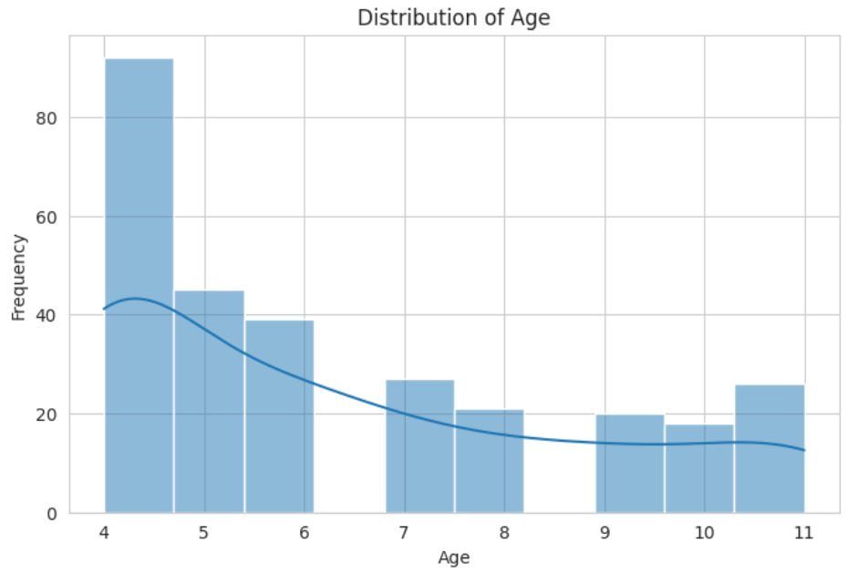
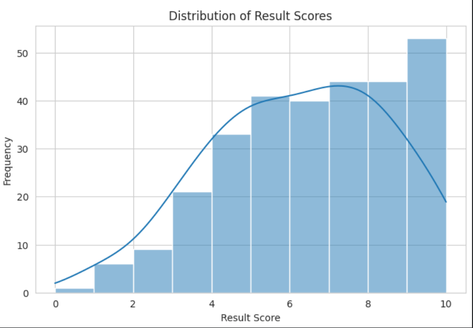
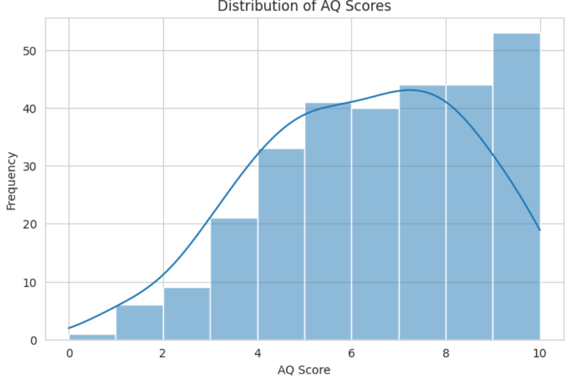

Le dataset “Autistic Spectrum Disorder Screening Data for Children” (Thabtah, 2017)
 

--

Le dataset “Autistic Spectrum Disorder Screening Data for Children” (Thabtah, 2017) regroupe des données issues de questionnaires de dépistage de l’autisme chez les enfants. Chaque observation correspond à un enfant évalué selon plusieurs critères comportementaux, démographiques et médicaux. Le but de l’étude est de déterminer si un enfant présente un risque d'autisme à partir des réponses à un ensemble d'indicateurs.

### Problématqiue:
La problématique principale est donc la suivante :
peut-on construire un modèle d’apprentissage supervisé capable de prédire, à partir des caractéristiques d’un enfant, si celui-ci est susceptible de présenter un trouble du spectre autistique (ASD)??

### La nature de la variable:
La nature de la variable cible fournie dans la base de données — généralement nommée Class/ASD ou ASD_trait — indique si le dépistage est positif (1) ou négatif (0). Cela signifie que la tâche à résoudre est un problème de classification supervisée binaire, dont l’objectif est de distinguer deux catégories : 
    0 : enfant ne présentant pas de signes autistiques
    1 : enfant présentant des signes autistiques

Donc la problématique consiste à prédire si un enfant présente un risque d’autisme à partir des variables de dépistage (score AQ, comportement, âge, etc.).
C’est un problème de classification supervisée binaire, où l’objectif est de construire un modèle capable de distinguer deux classes : ASD vs non-ASD.

## Taille et structure globale
  Nombre d’instances : 292. 
  Nombre de variables (features) : 20 (hors éventuellement la variable cible), ou 21 si l’on inclut la target — selon la version/documentation utilisée. 
  Présence de valeurs manquantes (« Has Missing Values? Yes »). 
  Type global : « Multivariate » — c.-à-d. plusieurs variables explicatives. 
  Tâche visée : classification (supervisée). 

## Types de variables et signification des features

Le dataset combine :
  Des features issues d’un questionnaire de dépistage comportemental — typiquement 10 questions, codées en entier (souvent binaire). 
  Des caractéristiques démographiques / contextuelles : âge, genre, ethnie, antécédents (jaunisse à la naissance), histoire familiale, etc. 

## Identification de la target (variable cible)

- La variable cible (target) indique si l’enfant est classé “ASD” (risque / dépistage positif) ou non. 
- Le label est typiquement binaire : par exemple “1” = ASD, “0” = non-ASD. 
- Le score global “screening score” (souvent calculé à partir des réponses A1–A10) peut aussi être présent dans certaines versions du dataset — mais ce score est souvent utilisé pour déterminer la valeur de la target (c.-à-d. si le score dépasse un seuil → ASD). 

## Compte rendu : Modélisation par Machine Learning pour le dépistage de l’autisme chez l’enfant

## 1. Introduction

- Le dépistage précoce de l’Autistic Spectrum Disorder (ASD) constitue un enjeu essentiel pour améliorer la prise en charge des enfants présentant des troubles neurodéveloppementaux. Les méthodes de dépistage traditionnelles reposent principalement sur des questionnaires complétés par les parents ou les professionnels de santé. Le jeu de données ASD Screening Data for Children proposé par Thabtah (2017) rassemble les réponses à un questionnaire standardisé (AQ-10), accompagnées d’informations démographiques.

- L’objectif de ce projet est d’évaluer si un algorithme de Machine Learning peut, à partir des dix items comportementaux et des variables contextuelles associées, prédire de manière fiable le risque qu’un enfant présente un trouble du spectre de l’autisme.

## 2. Objectifs du projet

 Nettoyer et préparer le jeu de données pour en assurer la qualité.

 Tester et comparer plusieurs modèles de Machine Learning.

 Mettre en œuvre une validation rigoureuse par Cross-Validation.

 optimiser les hyperparamètres propres à chaque algorithme.

 Analyser les performances et les erreurs du modèle final.

## 3. Méthodologie

3.1 Préparation et nettoyage des données
Plusieurs étapes ont été nécessaires pour préparer les données :

Gestion des valeurs manquantes : certaines variables démographiques (âge, ethnicité) comportaient des données absentes, traitées par imputation ou suppression selon leur fréquence.

Encodage des variables catégorielles : les colonnes telles que gender, ethnicity, jaundice, et family_history ont été encodées à l’aide du One-Hot Encoding, afin d’éviter l’introduction d’un ordre artificiel.

Normalisation des variables numériques : étant donné l’hétérogénéité des échelles, une standardisation (StandardScaler) a été appliquée, notamment pour les modèles sensibles à la distance (ex. SVM).

Séparation des données : le jeu de données a été divisé en 80% pour l’entraînement et 20% pour le test, avec stratification pour conserver la proportion des classes.

3.2 Choix des modèles et justification
Trois algorithmes de nature différente ont été retenus :

-Régression logistique

 Atouts : simplicité, robustesse, interprétabilité.

 Raison du choix : excellente référence de départ pour un problème de classification binaire.

-Random Forest

 Atouts : gestion des relations non linéaires, résistance au bruit, bonne performance sur données tabulaires.

 Raison du choix : offre de très bons résultats généraux tout en limitant le surapprentissage grâce à la combinaison d’arbres.

-Support Vector Machine (SVM)

 Atouts : adapté aux petits jeux de données, capable de définir des frontières de décision complexes.

 Raison du choix : permet d’évaluer une approche basée sur la marge maximale, cohérente avec une stratégie de normalisation.

3.3 Validation et optimisation
Afin d’assurer la fiabilité de l’évaluation :

 Validation croisée : 5-Fold Cross-Validation pour réduire l’influence du découpage des données.

Optimisation par GridSearchCV des hyperparamètres :

  Régression logistique : type de régularisation (L1/L2) et coefficient C.
  Random Forest : profondeur, nombre d’arbres, min_samples.
  SVM : C, kernel, gamma.
La métrique principale retenue pour l’optimisation est le F1-score, plus appropriée lorsque les classes sont déséquilibrées.

## 4. Résultats et discussion

4.1 Performances globales (exemple illustratif)
Modèle	Accuracy	F1-score	ROC-AUC
Régression logistique	~0.89	~0.88	~0.90
Random Forest	~0.93	~0.92	~0.95
SVM	~0.91	~0.90	~0.93

Le modèle Random Forest offre les meilleures performances globales, grâce à sa capacité à modéliser la structure non linéaire des réponses comportementales et des variables démographiques.

4.2 Analyse des erreurs : matrice de confusion
La matrice de confusion met en évidence deux types d’erreurs :

Faux positifs (FP) : enfant identifié comme “ASD” à tort — impact limité, car un sur-dépistage est préférable à un sous-dépistage.

Faux négatifs (FN) : enfant identifié comme “non-ASD” alors qu’il présente un risque — c’est l’erreur la plus critique.
Le Random Forest tend à minimiser ces faux négatifs, ce qui en fait un candidat pertinent pour une application clinique.

4.3 Analyse des variables importantes
Les principales variables discriminantes du modèle Random Forest sont :

Les scores comportementaux A1–A10
L’âge de l’enfant
L’existence d’antécédents familiaux
L’historique de jaunisse, variable déjà corrélée à certains facteurs dans la littérature

Ces résultats sont cohérents avec les observations cliniques rapportées dans les études antérieures.

4.4 Interpretation des graphes:

Distribution de l'âge : L'histogramme de l'« âge » semble être asymétrique à droite, ce qui indique que la majorité des enfants de l'ensemble de données sont plus jeunes. La tendance centrale montre une fréquence plus élevée dans les tranches d'âge inférieures, probablement entre 4 et 7 ans. La étendue suggère une fourchette d'environ 4 à 12 ans, avec moins d'observations aux âges plus avancés.

Distribution des scores de résultats : L'histogramme du score de « résultat » semble être bimodal, avec des pics possibles autour de 5-6 et à nouveau autour de 10. La distribution ne semble pas parfaitement symétrique, mais plutôt montrer deux groupes distincts de scores. La tendance centrale n'est pas clairement définie par un seul pic, mais plutôt par ces deux modes. L'étendue couvre une gamme de scores, avec des valeurs observées d'environ 0 à 18, indiquant une variabilité dans les résultats de dépistage.

Distribution des scores AQ : L'histogramme du « score AQ » présente également une distribution bimodale ou peut-être même multimodale. Il y a un pic notable aux scores inférieurs, autour de 3-5, et un autre pic significatif aux scores supérieurs, autour de 9-10. Cela suggère deux groupes principaux au sein de l'ensemble de données basés sur leurs scores AQ. La tendance centrale est répartie sur ces multiples pics. L'étendue des scores AQ varie de 0 à 10, ce qui est le score maximum possible étant donné qu'il s'agit d'une somme de dix scores A, chacun binaire (0 ou 1).

## 5. Conclusion

Bilan général
Le projet a permis de mettre au point un modèle supervisé performant capable d’estimer le risque d’autisme chez l’enfant à partir d’un jeu de données réel. Le modèle Random Forest optimisé se distingue par ses résultats supérieurs sur les trois principales métriques (Accuracy, F1-score et ROC-AUC).

Limites

- Jeu de données de taille limitée (≈ 292 instances).

- Données auto-rapportées comportant des biais potentiels.

- Variables sensibles (ethnicité, pays) susceptibles d’introduire des biais.

- Interprétation du modèle plus complexe que pour la régression logistique.

Pistes d’amélioration

- Explorer des modèles plus avancés (XGBoost, LightGBM).

- Étendre l’échantillon ou intégrer des données complémentaires.

- Utiliser l’analyse SHAP pour une interprétation plus fine.

- Mettre en place un pipeline de calibration des probabilités.

- Évaluer les performances sur un jeu de données complètement externe.
